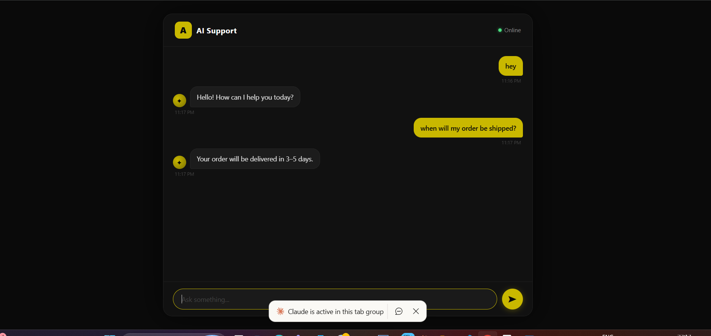
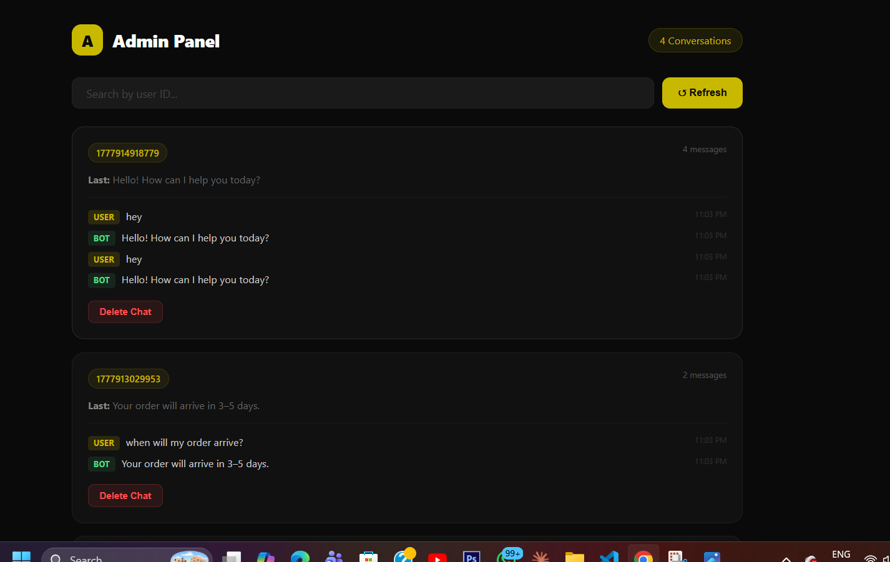
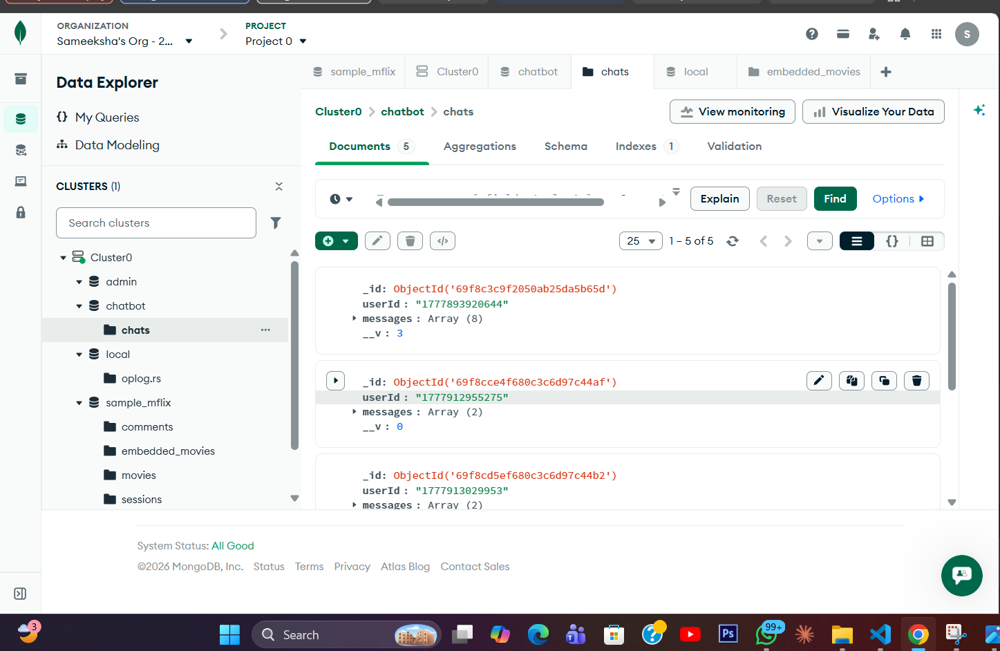

# AI Support Chatbot

A full-stack AI-powered customer support chatbot with a live admin dashboard, built with Node.js, MongoDB, and Google Gemini.

---

## Live Demo

- **Chatbot:** [thunderous-torte-3fb7c4.netlify.app](https://thunderous-torte-3fb7c4.netlify.app/)
- **Admin Panel:** [ai-support-chatbot-ql1c.onrender.com/admin](https://ai-support-chatbot-ql1c.onrender.com/admin)

---

## Features

### Chatbot
- Intent-based responses for 6+ support scenarios: order status, refunds, damaged products, delivery, returns, and more
- Damaged product flow with guided step-by-step resolution
- Conversational order status replies that adapt to delivery state (processing / shipped / out for delivery / delivered / returned)
- Markdown rendering in chat messages
- Typing simulation for realistic feel
- Quick reply buttons for common follow-ups
- Read receipts
- Post-reply satisfaction prompt with auto-close on resolution
- Chat history loaded on session start
- Dark / light mode toggle

### Backend
- Node.js + Express
- MongoDB Atlas with a rich orders schema (status, tracking number, carrier, timestamps)
- Live orders database queried per user message
- Human handoff routing
- Unanswered message logging

### Admin Dashboard
- Live real-time conversation view
- Search users by ID
- Latest message preview and timestamps
- Delete chats
- Total conversation analytics
- CSV export of all conversations

---

## Tech Stack

| Layer | Tech |
|-------|------|
| Frontend | HTML, CSS, JavaScript |
| Backend | Node.js, Express |
| Database | MongoDB Atlas |
| AI | Google Gemini API |
| Deployment | Backend → Render, Frontend → Netlify |

---

## Project Structure

```
ai-support-bot/
├── index.html        # Chatbot UI
├── admin.html        # Admin dashboard
├── server.js         # Backend server
├── package.json
└── .env              # API keys (not pushed)
```

---

## Setup

1. Clone the repo:
```bash
git clone https://github.com/Sameeksha-Goel/ai-support-chatbot.git
cd ai-support-chatbot
```

2. Install dependencies:
```bash
npm install
```

3. Create `.env`:
```
MONGO_URI=your_mongodb_connection_string
GEMINI_API_KEY=your_api_key
```

4. Run:
```bash
node server.js
```

5. Open `http://localhost:3000`

---

## Notes

- Free-tier Gemini API has request limits — chatbot shows a fallback message if quota is exceeded
- MongoDB Atlas free cluster used

---

## Screenshots

### Chatbot Interface


### Query Handling


### Admin Dashboard


### MongoDB Storage


---

## Author

**Sameeksha Goel**
